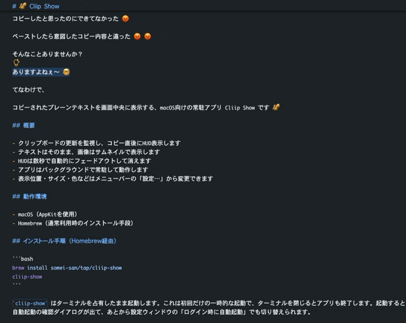

# 🥜 cliip-show

[日本語](README.ja.md)



You thought you copied it, but you didn't 😡

You pasted, and it was not what you copied 😡 😡

Sound familiar?

Of course it does 🤓

So here it is: `cliip-show`, a macOS menu bar app that shows what you just copied 🥜

## What it does

- Watches the clipboard and shows a HUD right after you copy
- Text is shown as-is, images as a thumbnail
- The HUD fades out on its own after a few seconds
- Runs in the background as a menu bar app

When a copy carries both text and an image (browsers and spreadsheets usually do), the text is shown.

The menu bar icon gives you:
- Settings…: opens the settings window (see [Settings](#settings))
- Pause: stops the HUD, with a checkmark while it is on. Anything copied while paused stays unshown after you resume
- Quit cliip-show

## Requirements

- macOS (built on AppKit)
- Homebrew (how you normally install it)

## Install (Homebrew)

```bash
brew install somei-san/tap/cliip-show
cliip-show
```

`cliip-show` holds the terminal while it runs. That is a one-off launch, and the app quits when you close the terminal. On startup it asks whether to start at login; enable it and the app comes up on its own from the next login.

You can switch that on and off any time from "Start at login" in the settings window (see [Settings](#settings)).

## Settings

Open the settings window from "Settings…" in the menu bar. It reads and writes the same file as `--config set`.

Changes are not saved as you make them. The buttons at the bottom decide what happens:
- Save: writes the changes to the file and applies them to the HUD (Enter does the same)
- Preview: applies the changes to the HUD without saving. It ignores the clipboard and cycles through fixed samples — short text, long text, image — one per press
- Restore Defaults: puts every item back to its default. Nothing is saved

Closing the window without saving goes back to what is in the file.

"Language" and "Start at login" work differently: both take effect the moment you change them, and neither is touched by "Restore Defaults". "Start at login" is an OS-level setting and is not written to the config file.

### From the command line

Initialize and inspect:

```bash
cliip-show --config init
cliip-show --config show
```

Set a value:

```bash
cliip-show --config set hud_duration_secs 2.5
cliip-show --config set hud_fade_duration_secs 0.5
cliip-show --config set max_lines 3
cliip-show --config set hud_position top
cliip-show --config set hud_scale 1.2
cliip-show --config set hud_background_color blue
cliip-show --config set hud_emoji 🍣
cliip-show --config set hud_image_max_height 120
```

Keys:
- `poll_interval_secs` (default `0.3`, `0.05` - `5.0`)
- `hud_duration_secs` (default `1.0`, `0.1` - `10.0`)
- `hud_fade_duration_secs` (default `0.3`, `0.0` - `2.0`; `0.0` disables the fade)
- `max_chars_per_line` (default `100`, `1` - `500`)
- `max_lines` (default `5`, `1` - `20`)
- `hud_position` (default `top`; `top` / `center` / `bottom`)
- `hud_scale` (default `1.1`, `0.5` - `2.0`)
- `hud_background_color` (default `default`; `default` / `yellow` / `blue` / `green` / `red` / `purple`)
- `hud_emoji` (default `📋`; any single emoji, empty for no icon)
- `hud_image_max_height` (default `160`, `40` - `240`) Max height of an image thumbnail in px. The effective cap is multiplied by `hud_scale`, and images are never scaled above their original size
- `language` (default `auto`; `auto` / `ja` / `en`) Language of the menu bar and the settings window. `auto` follows the macOS preferred language

> **Applied immediately:** changes take effect without a restart.

Environment variables override the config file.

```bash
CLIIP_SHOW_HUD_DURATION_SECS=2.5 \
CLIIP_SHOW_HUD_FADE_DURATION_SECS=0.5 \
CLIIP_SHOW_MAX_LINES=3 \
CLIIP_SHOW_HUD_POSITION=top \
CLIIP_SHOW_HUD_SCALE=1.2 \
CLIIP_SHOW_HUD_BACKGROUND_COLOR=blue \
CLIIP_SHOW_HUD_EMOJI=🍣 \
CLIIP_SHOW_HUD_IMAGE_MAX_HEIGHT=120 \
CLIIP_SHOW_LANGUAGE=en \
cargo run
```

Config file:
- Default path: `~/Library/Application Support/cliip-show/config.toml`
- Override: `CLIIP_SHOW_CONFIG_PATH=/path/to/config.toml`

### Links

- [Development guide](docs/development.md)
- [Homebrew tap repository](https://github.com/somei-san/homebrew-tap)

## About the name

The name plays on [an album by Creepy Nuts](https://en.wikipedia.org/wiki/Creepy_Nuts).
